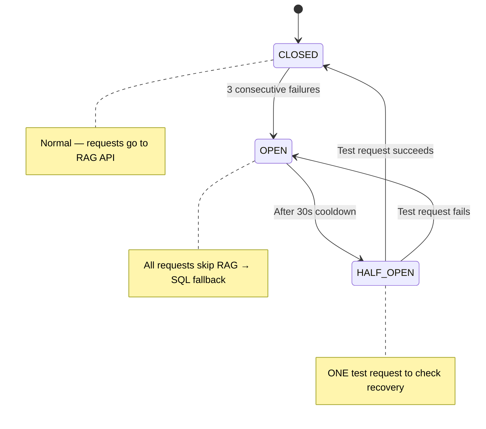

# PRD 9: Foundation & Resilience (Graph RAG Infrastructure)

> **Tech Stack:** Next.js (frontend), Express + Drizzle ORM (backend), FastAPI (RAG API), Neo4j 5 Community (graph DB), PostgreSQL `gold` schema, LiteLLM proxy → OpenAI models  
> **Auth:** Appwrite (B2C auth) → Express validates JWT → Express calls RAG API with service-to-service `X-API-Key`  
> **Repos:** `nutrib2c-frontend` (frontend), `nutrition-backend-b2c` (backend), `rag-pipeline-hybrid-reterival` (RAG API)  
> **Family Context:** All features support household/family member switching. The `households` table is the root entity; each member is a `b2c_customers` row linked via `household_id`. The logged-in user is the `is_profile_owner=true` member but can switch between family members stored in the same household.

---

## 9.1 Overview

Set up the infrastructure layer that every Graph RAG feature depends on: deploy Neo4j, wrap the existing RAG pipeline in a FastAPI HTTP API, create the resilient `ragClient.ts` in Express with circuit breaker + SQL fallback, automate PG→Neo4j data sync, and expand the Neo4j schema with 14 new node types and 22 relationship types.

**Core Resilience Rule:** If Neo4j or the RAG API fails at any point, the B2C app MUST continue working using existing SQL services. Users see identical UI — just less personalized results. This is **silent degradation**. Each feature has its own independent on/off flag, allowing progressive rollout.

**Current State:**

- Neo4j: Populated with Recipe, Ingredient, Allergen, Diet, Cuisine, B2CCustomer, Product nodes + GraphSAGE embeddings. No HTTP API — CLI-only pipeline.
- Express backend: Fully functional SQL services (search, feed, mealPlan, groceryList, scan, mealLog). No RAG integration.
- Frontend: No knowledge of RAG layer.

## 9.2 User Stories

| ID | Story | Priority |
|----|-------|----------|
| FN-1 | As a developer, I deploy Neo4j on Coolify so it's accessible by the RAG API container | P0 |
| FN-2 | As a developer, I wrap the RAG pipeline in a FastAPI HTTP API so Express can call it | P0 |
| FN-3 | As a developer, I have a `ragClient.ts` with circuit breaker so the app survives RAG outages | P0 |
| FN-4 | As a developer, I can enable/disable each graph feature independently via env flags | P0 |
| FN-5 | As a developer, PG data automatically syncs to Neo4j on a schedule | P0 |
| FN-6 | As a developer, Neo4j has uniqueness constraints and indexes for all new node types | P0 |
| FN-7 | As a developer, I can check the circuit breaker status via an admin endpoint | P1 |
| FN-8 | As a developer, all RAG API calls are logged with latency and fallback metrics | P1 |

## 9.3 Technical Architecture

### 9.3.1 Neo4j on Coolify

Deploy Neo4j 5 Community Edition as a Coolify service:

```yaml
image: neo4j:5-community
ports: [7474, 7687]  # internal only — NOT exposed publicly
env:
  NEO4J_AUTH: neo4j/${SECURE_PASSWORD}
  NEO4J_PLUGINS: '["apoc"]'
  NEO4J_dbms_memory_heap_max__size: 1G
  NEO4J_dbms_memory_pagecache_size: 512M
volumes:
  - neo4j-data:/data
  - neo4j-logs:/logs
```

**Security:** Neo4j ports exposed only within Coolify's internal Docker network. No public-facing ports. Only the RAG API container can reach `bolt://neo4j:7687`.

**Data seeding:** Run existing population scripts → verify all node types present → run GraphSAGE embedding script.

### 9.3.2 FastAPI Wrapper for RAG Pipeline

Create `api.py` in `rag-pipeline-hybrid-reterival/` — see [06-rag-pipeline-changes.md](../06-rag-pipeline-changes.md) for full implementation details.

**Endpoints:**

```
GET  /health                    → { status: "ok", neo4j: "connected" }
POST /search/hybrid             → Semantic + structural recipe search
POST /recommend/feed            → Personalized feed with graph scoring
POST /recommend/meal-candidates → Pre-scored recipe candidates for meal planning
POST /recommend/products        → Allergen-safe product recommendations
POST /recommend/alternatives    → Scanner post-scan alternatives
POST /analytics/meal-patterns   → Meal log variety/pattern analysis
POST /chat/process              → Chatbot NLU + response generation
```

**Security:** Service-to-service auth via `X-API-Key` header. No user credentials forwarded.

**Dockerfile:** Multi-stage build, non-root user, health check on port 8000.

### 9.3.3 ragClient.ts — Circuit Breaker + SQL Fallback

Create `server/services/ragClient.ts` in Express backend:

**Circuit Breaker State Machine:**



**Per-Feature Independent Flags (all OFF by default):**

| Flag | Feature | Timeout (Testing) | Timeout (Prod) |
|------|---------|-------------------|----------------|
| `USE_GRAPH_SEARCH` | Search | 60s | 3s |
| `USE_GRAPH_FEED` | Feed | 60s | 3s |
| `USE_GRAPH_MEAL_PLAN` | Meal Planning | 60s | 5s |
| `USE_GRAPH_GROCERY` | Grocery List | 60s | 3s |
| `USE_GRAPH_SCANNER` | Scanner | 60s | 3s |
| `USE_GRAPH_MEAL_LOG` | Meal Log | 60s | 3s |
| `USE_GRAPH_CHATBOT` | Chatbot | 60s | 10s |

**Request Flow (3 gates before any RAG call):**

1. **Gate 1 — Feature flag:** Is this feature's graph flag ON? If not → return `null` → SQL.
2. **Gate 2 — Circuit breaker:** Is the circuit CLOSED or HALF_OPEN? If OPEN → return `null` → SQL.
3. **Gate 3 — HTTP call with timeout:** Call RAG API. If timeout/error → increment failure count → return `null` → SQL.

**Fallback Mapping (when `callRag()` returns `null`):**

| Feature | RAG Function | SQL Fallback Function | What User Loses |
|---------|-------------|----------------------|-----------------|
| Search | `ragSearch()` | `searchRecipes()` | Semantic similarity, graph scoring |
| Feed | `ragFeed()` | `getPersonalizedFeed()` | Collaborative filtering, graph reasons |
| Meal Plan | `ragMealCandidates()` | `fetchRecipeCatalog()` | Graph-scored candidates, variety optimization |
| Grocery | `ragProducts()` | `fetchIngredientMappedCandidates()` | Graph substitution suggestions |
| Scanner | `ragAlternatives()` | *(no alternatives shown)* | Allergen-safe alternative products |
| Meal Log | `ragMealPatterns()` | `getHistory()` | Cross-cuisine variety scores |
| Chatbot | `ragChat()` | **"Service temporarily unavailable"** | Entire chatbot functionality |

### 9.3.4 PG → Neo4j Sync Automation

Create `sync/pg_sync.py` in RAG pipeline repo:

**Sync Strategy:** Scheduled MERGE-based sync (idempotent, safe to re-run, uses read-only PG credentials).

| Priority | PG Table(s) | Neo4j Target | Frequency |
|----------|-------------|-------------|-----------|
| P0 | `b2c_customers` | `B2CCustomer` | Every 15 min |
| P0 | `b2c_customer_allergens` | `[:ALLERGIC_TO]` | Every 15 min |
| P0 | `b2c_customer_dietary_preferences` | `[:FOLLOWS_DIET]` | Every 15 min |
| P0 | `b2c_customer_health_profiles` | `HealthProfile` | Every 15 min |
| P1 | `recipes` + `recipe_ingredients` | `Recipe`, `[:USES_INGREDIENT]` | Every 6 hours |
| P1 | `products` + `product_ingredients` | `Product` | Every 6 hours |
| P2 | `meal_logs` + `meal_log_items` | `MealLog`, `[:LOGGED_MEAL]` | Every 15 min |
| P2 | `customer_product_interactions` | `[:SAVED]`, `[:VIEWED]`, `[:RATED]` | Every 15 min |
| P3 | `meal_plans` + `meal_plan_items` | `MealPlan`, `[:HAS_PLAN]` | Every 6 hours |
| P3 | `shopping_lists` + items | `ShoppingList`, `[:HAS_LIST]` | Every 6 hours |

### 9.3.5 Neo4j Schema Expansion

**Before first sync, run:**

- 14 uniqueness constraints (prevent duplicate nodes)
- 7 performance indexes (speed up date range/customer lookups)

**New node types (14):** MealPlan, MealPlanItem, MealLog, MealLogItem, ShoppingList, ShoppingListItem, RecipeRating, ScanEvent, Household, HouseholdMember, HouseholdBudget, HealthProfile, MealLogTemplate, MealLogStreak

**New relationship types (22):** HAS_PLAN, CONTAINS_ITEM, PLANS_RECIPE, LOGGED_MEAL, OF_RECIPE, OF_PRODUCT, HAS_LIST, DERIVED_FROM, RATED, SAVED, VIEWED, SCANNED, BELONGS_TO_HOUSEHOLD, HAS_MEMBER, HAS_BUDGET, HAS_PROFILE, CAN_SUBSTITUTE, etc.

> Full MERGE scripts and constraint DDL are documented in the implementation plan Section 1.5 and in [06-rag-pipeline-changes.md](../06-rag-pipeline-changes.md).

### 9.3.6 PostgreSQL — 1 New Table

```sql
CREATE TABLE gold.chat_sessions (
  id UUID PRIMARY KEY DEFAULT gen_random_uuid(),
  b2c_customer_id UUID NOT NULL REFERENCES gold.b2c_customers(id) ON DELETE CASCADE,
  session_data JSONB NOT NULL DEFAULT '{}',
  message_count INT NOT NULL DEFAULT 0,
  last_intent VARCHAR(50),
  created_at TIMESTAMPTZ NOT NULL DEFAULT NOW(),
  last_activity_at TIMESTAMPTZ NOT NULL DEFAULT NOW(),
  expires_at TIMESTAMPTZ NOT NULL DEFAULT NOW() + INTERVAL '30 minutes'
);

CREATE INDEX idx_chat_sessions_customer ON gold.chat_sessions(b2c_customer_id);
CREATE INDEX idx_chat_sessions_expires ON gold.chat_sessions(expires_at) WHERE expires_at < NOW();
```

### 9.3.7 Frontend Changes

None in this PRD — this is pure infrastructure. Frontend changes are in feature-specific PRDs (10–18).

---

## 9.RAG — RAG Team Scope

> **Repo:** `rag-pipeline-hybrid-reterival`  
> **Owner:** RAG Pipeline Engineer  
> **The B2C team does NOT touch these files.** This section documents what the RAG team must deliver for this PRD.

### Deliverables

#### 1. FastAPI Wrapper (`api.py`)

Create the HTTP API that wraps the existing CLI-only RAG pipeline. All 7 endpoints listed in Section 9.3.2 must be implemented:

| Endpoint | Handler | Input | Output |
|----------|---------|-------|--------|
| `GET /health` | Health check | — | `{ status, neo4j }` |
| `POST /search/hybrid` | Hybrid semantic + structural search | `{ query, filters, customer_id }` | `{ results: [{ id, score, reasons }] }` |
| `POST /recommend/feed` | Personalized feed scoring | `{ customer_id, preferences }` | `{ results: [{ id, score, reasons, source }] }` |
| `POST /recommend/meal-candidates` | Pre-scored meal plan candidates | `{ customer_id, members, meal_history, ... }` | `{ candidates: [{ recipe_id, score, reasons }] }` |
| `POST /recommend/products` | Allergen-safe product matching | `{ ingredient_ids, customer_allergens }` | `{ products: [{ ingredient_id, product_id, ... }] }` |
| `POST /recommend/alternatives` | Post-scan product alternatives | `{ product_id, customer_allergens }` | `{ alternatives: [{ product_id, reason, savings }] }` |
| `POST /analytics/meal-patterns` | Meal log variety analysis | `{ customer_id, days }` | `{ varietyScore, repeatedMeals, cuisineBreakdown, ... }` |
| `POST /chat/process` | Chatbot NLU + response | `{ message, customer_id, session_id }` | `{ response, intent, session_id, ... }` |

#### 2. Service-to-Service Auth

- Implement `X-API-Key` middleware that validates the shared secret from request headers
- Reject requests without valid key with 401

#### 3. Dockerfile

- Multi-stage build (builder + runtime)
- Non-root user
- Health check: `CMD ["curl", "-f", "http://localhost:8000/health"]`
- Expose port 8000

#### 4. Neo4j Schema Expansion

Run the following before first PG→Neo4j sync:

- 14 uniqueness constraints (full DDL in implementation plan Section 1.5)
- 7 performance indexes (full DDL in implementation plan Section 1.5)

#### 5. PG → Neo4j Sync Script (`sync/pg_sync.py`)

- Connect to PG via read-only credentials (`PG_READ_URL`)
- MERGE-based sync for all tables listed in Section 9.3.4
- Idempotent (safe to re-run)
- Cron-compatible (exit 0 on success, non-zero on error)
- Log sync stats (rows synced per table, duration)

#### 6. Environment Variables (RAG API side)

```env
NEO4J_URI=bolt://neo4j:7687
NEO4J_USERNAME=neo4j
NEO4J_PASSWORD=<secure-password>
NEO4J_DATABASE=neo4j
PG_READ_URL=postgresql://<read-only-user>:<password>@<supabase-host>:5432/postgres
RAG_API_KEY=<shared-secret>
```

## 9.4 Acceptance Criteria

- [ ] Neo4j deployed on Coolify, accessible from RAG API container on `bolt://neo4j:7687`
- [ ] `/health` endpoint returns `{ status: "ok", neo4j: "connected" }`
- [ ] All 7 RAG API endpoints respond to POST requests with valid responses
- [ ] `ragClient.ts` compiles and all 7 `ragXxx()` functions return `null` when flags are OFF
- [ ] Circuit breaker trips after 3 consecutive failures, auto-resets after 30s
- [ ] PG→Neo4j sync runs without errors for all P0 tables
- [ ] All 14 uniqueness constraints created in Neo4j
- [ ] All 7 performance indexes created in Neo4j
- [ ] `chat_sessions` table exists in PG with correct indexes
- [ ] Existing SQL services continue to work unchanged (regression test)

## 9.5 Route Registration

Add to `server/routes.ts`:

```typescript
// Admin/debug endpoint for circuit breaker diagnostics
import { getCircuitStatus } from "./services/ragClient.js";

app.get("/api/v1/admin/rag-status", requireAuth, requireSuperadmin, (req, res) => {
  res.json(getCircuitStatus());
});
```

## 9.6 Environment Variables

```env
# Neo4j (Coolify service)
NEO4J_URI=bolt://neo4j:7687
NEO4J_USERNAME=neo4j
NEO4J_PASSWORD=<secure-password>
NEO4J_DATABASE=neo4j

# RAG API connection (Express → FastAPI)
RAG_API_URL=http://rag-api:8000
RAG_API_KEY=<shared-secret>

# Per-feature flags (all OFF by default — enable one at a time)
USE_GRAPH_SEARCH=false
USE_GRAPH_FEED=false
USE_GRAPH_MEAL_PLAN=false
USE_GRAPH_GROCERY=false
USE_GRAPH_SCANNER=false
USE_GRAPH_MEAL_LOG=false
USE_GRAPH_CHATBOT=false

# Sync (PG→Neo4j, read-only credentials)
PG_READ_URL=postgresql://<read-only-user>:<password>@<supabase-host>:5432/postgres
```
