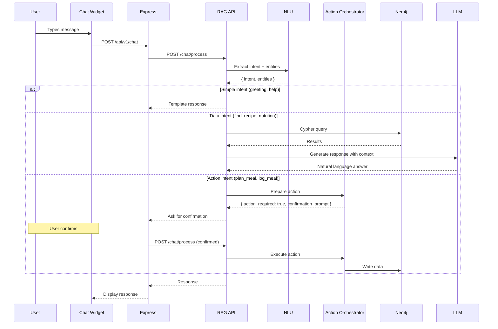

# PRD 16: AI Chatbot

> **Tech Stack:** Next.js (frontend), Express + Drizzle ORM (backend), FastAPI (RAG API), Neo4j 5 (graph DB), PostgreSQL `gold` schema, LiteLLM proxy → OpenAI models  
> **Auth:** Appwrite (B2C auth)  
> **Repos:** `nutrib2c-frontend` (frontend), `nutrition-backend-b2c` (backend), `rag-pipeline-hybrid-reterival` (RAG API)  
> **Family Context:** All features support household/family member switching. The `households` table is the root entity; each member is a `b2c_customers` row linked via `household_id`.  
> **Depends On:** PRD-09 (Foundation & Resilience), PRD-10 (Search — chatbot uses search intents), PRD-12 (Meal Planning — chatbot can trigger plan actions)

---

## 16.1 Overview

Build a conversational AI chatbot as a floating widget across the app. The chatbot understands natural language requests about food, recipes, meal planning, and nutrition via a hybrid NLU engine (rule-based for common patterns + LLM for complex queries). It can search recipes, show nutrition info, help with meal planning, log meals, and answer dietary questions — all grounded in the user's actual data from the graph.

**Why Neo4j matters for chatbot:** A generic LLM chatbot would hallucinate recipe names and nutrition facts. By grounding every response in graph data (the user's actual allergens, their real meal history, recipes that actually exist in the database), the chatbot gives accurate, personalized answers. Example: "What should I eat tonight?" → graph finds recipes matching the user's diet, excluding recent meals, filling nutritional gaps → LLM formats a friendly response.

**Current State:**

- No chatbot exists anywhere in the codebase.
- The RAG pipeline has a basic NLU engine (`extractor_classifier.py`) with 8 intents — needs 9 more for chatbot.

**SQL Fallback:** The chatbot is 100% graph-dependent. When `USE_GRAPH_CHATBOT=false` or RAG API is down → the chat widget shows a friendly message: *"I'm temporarily unavailable. Please try again in a few minutes."*

## 16.2 User Stories

| ID | Story | Priority |
|----|-------|----------|
| CB-1 | As a user, I tap a floating chat button to open the chatbot | P0 |
| CB-2 | As a user, I say "find me a keto dinner" and get real recipe results | P0 |
| CB-3 | As a user, I ask "what's in avocado?" and get nutrition facts | P0 |
| CB-4 | As a user, I say "plan my meals for next week" and the chatbot starts the meal plan flow | P1 |
| CB-5 | As a user, I say "log my lunch — had the chicken salad" and it logs the meal | P1 |
| CB-6 | As a user, I ask "what did I eat today?" and see a summary | P1 |
| CB-7 | As a user, the chatbot remembers context within a session (multi-turn) | P0 |
| CB-8 | As a user, action requests (plan, log) require my confirmation before executing | P0 |
| CB-9 | As a user, the chatbot greets me by name and knows my dietary preferences | P1 |
| CB-10 | As a user, I see a helpful message if the chatbot is unavailable | P0 |

## 16.3 Technical Architecture

### 16.3.1 Chatbot Pipeline (in RAG API)



### 16.3.2 NLU Intent Categories

The chatbot NLU handles 17 intents (8 existing + 9 new):

| Intent | Example | Type | New? |
|--------|---------|------|------|
| `find_recipe` | "find me a vegan breakfast" | Data (graph search) | Existing |
| `find_recipe_by_pantry` | "what can I make with chicken and rice?" | Data (graph search) | Existing |
| `get_nutritional_info` | "how many calories in avocado?" | Data (graph lookup) | Existing |
| `suggest_alternative` | "what can I use instead of butter?" | Data (graph traversal) | Existing |
| `greeting` | "hi", "hello" | Template | New |
| `help` | "what can you do?" | Template | New |
| `farewell` | "bye", "thanks" | Template | New |
| `plan_meals` | "plan my meals for next week" | Action (requires confirmation) | New |
| `show_meal_plan` | "show my current meal plan" | Data (graph lookup) | New |
| `log_meal` | "I had the chicken salad for lunch" | Action (requires confirmation) | New |
| `meal_history` | "what did I eat today?" | Data (graph query) | New |
| `grocery_list` | "add milk to my grocery list" | Action (requires confirmation) | New |
| `dietary_advice` | "is this recipe safe for my daughter?" | Data (graph + LLM) | New |
| `nutrition_summary` | "how's my nutrition this week?" | Data (graph analytics) | New |
| `swap_meal` | "swap tonight's dinner for something lighter" | Action (requires confirmation) | New |
| `set_preference` | "I'm now following a keto diet" | Action (requires confirmation) | New |
| `unclear` | Anything else | LLM fallback | Existing |

### 16.3.3 Backend API (Express)

#### [NEW] `server/services/chatbot.ts`

```typescript
import { ragChat } from "./ragClient.js";
import { db } from "../config/database.js";
import { chatSessions } from "../../shared/goldSchema.js";

export async function processMessage(
  customerId: string,
  message: string,
  sessionId?: string
): Promise<ChatResponse> {
  // Try RAG chatbot
  const ragResponse = await ragChat(message, customerId, sessionId);

  if (ragResponse) {
    // Update session in PG (session data stored as JSONB)
    if (ragResponse.session_id) {
      await updateSession(customerId, ragResponse.session_id, {
        lastIntent: ragResponse.intent,
        messageCount: ragResponse.message_count,
      });
    }

    return {
      message: ragResponse.response,
      intent: ragResponse.intent,
      sessionId: ragResponse.session_id,
      actionRequired: ragResponse.action_required || false,
      confirmationPrompt: ragResponse.confirmation_prompt,
      recipes: ragResponse.recipes || [],
      nutritionData: ragResponse.nutrition_data,
    };
  }

  // Chatbot unavailable fallback
  return {
    message: "I'm temporarily unavailable. Please try again in a few minutes. You can still search for recipes and manage your meal plans using the regular app features.",
    intent: "unavailable",
    sessionId: null,
    actionRequired: false,
  };
}
```

#### [NEW] `server/routes/chat.ts`

```typescript
router.post("/", requireAuth, async (req, res) => {
  const { message, sessionId } = req.body;
  
  if (!message || typeof message !== "string" || message.length > 500) {
    return res.status(400).json({ error: "Message required (max 500 chars)" });
  }

  const response = await processMessage(req.user.id, message.trim(), sessionId);
  res.json(response);
});

router.get("/history", requireAuth, async (req, res) => {
  const sessions = await getRecentSessions(req.user.id, 10);
  res.json({ sessions });
});
```

### 16.3.4 Session Management

Chat sessions are stored in PG (`gold.chat_sessions`) — NOT in Neo4j:

- **Session creation:** First message creates a session with 30-min TTL
- **Session reuse:** Subsequent messages in the same session include chat history for context
- **Session expiry:** Cleanup cron deletes sessions where `expires_at < NOW()`
- **Session data:** Stored as JSONB (includes last 10 messages for context window)

### 16.3.5 Action Confirmations

Action intents (plan_meal, log_meal, grocery_list, swap_meal) require explicit user confirmation:

```json
// User: "log my lunch — chicken salad"
// Bot response:
{
  "message": "I'll log Chicken Salad as your lunch for today. Shall I go ahead?",
  "intent": "log_meal",
  "action_required": true,
  "confirmation_prompt": "Log Chicken Salad for lunch today?",
  "pending_action": {
    "type": "log_meal",
    "params": { "recipe": "Chicken Salad", "meal_type": "lunch", "date": "2026-03-15" }
  }
}

// User: "yes"
// Bot executes the action and responds with confirmation
```

### 16.3.6 Database Tables Used

| Table | Usage | Exists? |
|-------|-------|---------|
| `gold.chat_sessions` | Session persistence | **NEW** (created in PRD-09) |
| `gold.b2c_customers` | User name for greetings | Yes |
| `gold.b2c_customer_allergens` | Dietary context | Yes |
| `gold.b2c_customer_dietary_preferences` | Dietary context | Yes |
| `gold.recipes` | Recipe lookup for responses | Yes |

### 16.3.7 Frontend Changes

| File | Change |
|------|--------|
| **[NEW]** `components/chat/chat-widget.tsx` | Floating chat button + slide-up chat panel |
| **[NEW]** `components/chat/chat-bubble.tsx` | Individual message bubble (user/bot variants) |
| **[NEW]** `components/chat/chat-input.tsx` | Text input with send button |
| **[NEW]** `components/chat/action-confirmation.tsx` | Inline confirmation card for actions |
| **[NEW]** `components/chat/recipe-result-card.tsx` | Compact recipe card for chat results |
| **[NEW]** `components/chat/nutrition-mini-card.tsx` | Inline nutrition display |
| **[NEW]** `lib/chat-api.ts` | API client for chat endpoints |
| `app/layout.tsx` | Add `<ChatWidget />` to global layout |

**Chat Widget:**

```tsx
// components/chat/chat-widget.tsx
export function ChatWidget() {
  const [isOpen, setIsOpen] = useState(false);
  const [messages, setMessages] = useState<ChatMessage[]>([]);
  const [sessionId, setSessionId] = useState<string | null>(null);

  return (
    <>
      {/* Floating Action Button */}
      <Button
        onClick={() => setIsOpen(!isOpen)}
        className="fixed bottom-6 right-6 rounded-full w-14 h-14 shadow-lg z-50"
      >
        {isOpen ? <X /> : <MessageCircle />}
      </Button>

      {/* Chat Panel */}
      {isOpen && (
        <div className="fixed bottom-24 right-6 w-96 h-[500px] bg-background border rounded-2xl shadow-xl flex flex-col z-50">
          <ChatHeader onClose={() => setIsOpen(false)} />
          <ChatMessages messages={messages} />
          <ChatInput onSend={handleSend} />
        </div>
      )}
    </>
  );
}
```

## 16.4 Acceptance Criteria

- [ ] Floating chat button appears on all pages
- [ ] "hi" returns a personalized greeting with user's name
- [ ] "find me a keto recipe" returns real recipe results from graph
- [ ] "what's in avocado?" returns nutrition facts
- [ ] "plan my meals for next week" asks for confirmation before action
- [ ] Multi-turn context works ("find a vegan recipe" → "something quicker" uses vegan filter)
- [ ] Chat session persists for 30 minutes of inactivity
- [ ] When `USE_GRAPH_CHATBOT=false`, widget shows "temporarily unavailable" message
- [ ] Messages are capped at 500 characters
- [ ] Chat responses appear within 60s (testing timeout)
- [ ] Action confirmations display as inline cards with Yes/No buttons

---

## 16.RAG — RAG Team Scope

> **Repo:** `rag-pipeline-hybrid-reterival`  
> **Owner:** RAG Pipeline Engineer  
> **The B2C team does NOT touch these files.** This is the largest RAG team deliverable.

### Deliverables

#### 1. `POST /chat/process` Endpoint

The core chatbot handler: NLU extraction → intent routing → graph queries → LLM response:

**Request:**

```json
{
  "message": "find me a keto dinner",
  "customer_id": "uuid",
  "session_id": "session-uuid-or-null"
}
```

**Response:**

```json
{
  "response": "Here are 3 keto dinner options based on your preferences...",
  "intent": "find_recipe",
  "session_id": "session-uuid",
  "message_count": 3,
  "action_required": false,
  "recipes": [
    { "id": "uuid", "title": "Keto Chicken Bowl", "score": 0.9 }
  ]
}
```

**Action response (for log/plan intents):**

```json
{
  "response": "I'll log Chicken Salad as your lunch for today. Shall I go ahead?",
  "intent": "log_meal",
  "action_required": true,
  "confirmation_prompt": "Log Chicken Salad for lunch today?",
  "pending_action": {
    "type": "log_meal",
    "params": { "recipe": "Chicken Salad", "meal_type": "lunch" }
  }
}
```

#### 2. NLU Engine — Add 9 New Intents

Extend existing `extractor_classifier.py` (currently 8 intents) with 9 new chatbot intents:

| New Intent | Example Utterance | Handler Type |
|-----------|-------------------|-------------|
| `greeting` | "hi", "hello" | Template response |
| `help` | "what can you do?" | Template response |
| `farewell` | "bye", "thanks" | Template response |
| `plan_meals` | "plan my meals for next week" | Action (confirmation) |
| `show_meal_plan` | "show my current meal plan" | Graph lookup |
| `log_meal` | "I had chicken salad for lunch" | Action (confirmation) |
| `meal_history` | "what did I eat today?" | Graph query |
| `nutrition_summary` | "how's my nutrition this week?" | Graph analytics |
| `swap_meal` | "swap tonight's dinner" | Action (confirmation) |

#### 3. Action Orchestrator

For action intents (`plan_meals`, `log_meal`, `swap_meal`):

1. Parse action parameters from entities
2. Return `action_required: true` with confirmation prompt
3. On confirmation (next message = "yes"/"confirm"), execute the write operation in Neo4j
4. Return success response

#### 4. Session Context

Maintain conversation context across turns:

- Store last 10 messages per session for LLM context window
- Carry forward slot values (e.g., "vegan" from turn 1 applies to turn 2's "something quicker")
- Reset context on new session

## 16.5 Route Registration

Add to `server/routes.ts`:

```typescript
import chatRouter from "./routes/chat.js";
app.use("/api/v1/chat", chatRouter);
```

## 16.6 Environment Variables

```env
USE_GRAPH_CHATBOT=false  # Set to 'true' to enable chatbot
# NLU + generation models configured in RAG API (see PRD-09)
```
