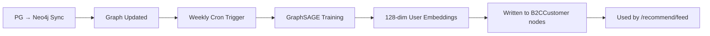

# PRD 17: Collaborative Filtering

> **Tech Stack:** Next.js (frontend), Express + Drizzle ORM (backend), FastAPI (RAG API), Neo4j 5 (graph DB), PostgreSQL `gold` schema  
> **Auth:** Appwrite (B2C auth)  
> **Repos:** `nutrib2c-frontend` (frontend), `nutrition-backend-b2c` (backend), `rag-pipeline-hybrid-reterival` (RAG API)  
> **Family Context:** All features support household/family member switching. The `households` table is the root entity; each member is a `b2c_customers` row linked via `household_id`.  
> **Depends On:** PRD-09 (Foundation & Resilience), PRD-11 (Feed — collaborative filtering enhances feed scoring)

---

## 17.1 Overview

Implement collaborative filtering powered by GraphSAGE embeddings: "users with similar dietary profiles and interaction histories tend to like similar recipes." This enables recommendations like "Users like you also enjoyed..." and significantly improves feed personalization quality. The system ships with a cold-start strategy that progressively increases collaborative filtering weight as user interaction data grows.

**Why this matters:** Currently, the feed sorts by popularity (saved-count) and recency. This works at scale but fails for individual users — a keto user and a vegan user see the same trending recipes. Collaborative filtering clusters users by behavior (what they saved, rated, cooked) and recommends recipes that similar users enjoyed. GraphSAGE generates user embeddings from the graph structure (diet preferences, allergens, interaction patterns) that capture these similarities.

**Current State:**

- GraphSAGE: Training script exists in RAG pipeline, runs manually. Generates 128-dim embeddings per user.
- Neo4j: User interaction edges (`[:RATED]`, `[:SAVED]`, `[:VIEWED]`) exist after PG→Neo4j sync runs.
- No automated retraining, no cold-start handling, no exposure to frontend.

**SQL Fallback:** If collaborative filtering data is unavailable → feed falls back to popularity-based sorting (which is what `getPersonalizedFeed()` already does). No user-visible difference — just less personalized ranking.

## 17.2 User Stories

| ID | Story | Priority |
|----|-------|----------|
| CF-1 | As a new user (cold start), I get reasonable recommendations within my first session | P0 |
| CF-2 | As a returning user, my feed improves as I interact more (rate, save, cook) | P0 |
| CF-3 | As a user, I see "Users like you also enjoyed..." on some recipe cards | P1 |
| CF-4 | As a developer, GraphSAGE retrains weekly without manual intervention | P0 |
| CF-5 | As a developer, cold-start weight transitions automatically based on interaction count | P0 |

## 17.3 Technical Architecture

### 17.3.1 Cold-Start Strategy

New users have zero interaction edges → collaborative filtering has nothing to work with. The system progressively shifts weight from content-based (structural) to collaborative filtering as interactions grow:

| User Interactions | Structural Weight | Collaborative Weight | Strategy |
|-------------------|------------------|---------------------|----------|
| 0–5 | 1.0 | 0.0 | Pure content-based (diet, allergens, cuisine match) |
| 6–15 | 0.7 | 0.3 | Blend — start incorporating similar users |
| 16–30 | 0.5 | 0.5 | Equal blend |
| 31+ | 0.3 | 0.7 | Heavy collaborative — user has strong signal |

### 17.3.2 GraphSAGE Embedding Pipeline



#### [NEW] `sync/train_graphsage.py` in RAG pipeline repo

```python
# Automate weekly GraphSAGE training
# 1. Read current graph (users, recipes, interactions)
# 2. Train 2-layer GraphSAGE model
# 3. Generate 128-dim embedding per user
# 4. Write embeddings back to B2CCustomer nodes
# 5. Log training metrics (loss, node coverage)
```

**Cron schedule:** Weekly (Sunday 3am UTC) via Coolify cron service or container CMD.

### 17.3.3 Collaborative Scoring in RAG API

The RAG API's `/recommend/feed` already does structural scoring. This PRD adds a collaborative scoring step:

```python
# Inside the feed recommendation handler:
def score_recipe_for_user(user_embedding, recipe, structural_score, interaction_count):
    """Blend structural and collaborative scores based on cold-start weight."""
    
    # Get collaborative score: cosine similarity between user embedding
    # and the embeddings of users who highly rated this recipe
    collab_score = compute_collaborative_score(user_embedding, recipe.id)
    
    # Progressive weight based on interaction count
    collab_weight = get_collaborative_weight(interaction_count)
    struct_weight = 1.0 - collab_weight
    
    final_score = (struct_weight * structural_score) + (collab_weight * collab_score)
    
    # Determine reason
    if collab_weight > 0.3 and collab_score > 0.7:
        reasons.append("Popular with users who share your preferences")
    
    return final_score, reasons
```

### 17.3.4 Cypher for Collaborative Scoring

```cypher
// Find recipes that similar users rated highly
// "Similar users" = users whose GraphSAGE embedding is close to the target user
MATCH (target:B2CCustomer {id: $userId})
WHERE target.graphsage_embedding IS NOT NULL

MATCH (similar:B2CCustomer)-[r:RATED]->(recipe:Recipe)
WHERE similar.graphsage_embedding IS NOT NULL
  AND similar.id <> $userId
  AND r.rating >= 4
  AND gds.similarity.cosine(target.graphsage_embedding, similar.graphsage_embedding) > 0.7

WITH recipe, 
     avg(r.rating) AS avgRating, 
     count(similar) AS similarUserCount,
     collect(DISTINCT similar.id)[0..5] AS sampleUsers

WHERE similarUserCount >= 2  // at least 2 similar users rated it

RETURN recipe.id, avgRating, similarUserCount
ORDER BY avgRating * log(similarUserCount + 1) DESC
LIMIT 50
```

### 17.3.5 Backend Changes (Express)

Minimal — collaborative filtering runs entirely inside the RAG API. Express only needs to pass the user ID, which it already does in `ragFeed()`.

The cold-start weight calculation can optionally be done in Express (to avoid calling RAG for zero-interaction users):

```typescript
// In feed service, before calling ragFeed():
async function getUserInteractionCount(userId: string): Promise<number> {
  const result = await executeRaw(
    `SELECT COUNT(*) as cnt FROM gold.customer_product_interactions 
     WHERE b2c_customer_id = $1`,
    [userId]
  );
  return parseInt(result[0]?.cnt ?? "0");
}

// Skip RAG for brand-new users (0 interactions) — pure SQL is sufficient
const interactions = await getUserInteractionCount(userId);
if (interactions === 0) {
  return getPersonalizedFeed(userId, limit, offset);
}
```

### 17.3.6 Database Tables Used (Already Exist)

| Table | Usage |
|-------|-------|
| `gold.customer_product_interactions` | Interaction count for cold-start weight |
| `gold.recipe_ratings` | Rating data for collaborative scoring (synced to Neo4j) |

### 17.3.7 Frontend Changes

| File | Change |
|------|--------|
| Feed card component | Show "Users like you enjoyed this" badge when collaborative source |
| **[NEW]** `components/feed/collaborative-badge.tsx` | Badge for collaborative filtering reasons |

```tsx
// Only shown when the reason source is "collaborative_filtering"
{reason.source === "collaborative_filtering" && (
  <Badge variant="outline" className="text-xs gap-1">
    <Users className="w-3 h-3" />
    Users like you enjoyed this
  </Badge>
)}
```

## 17.4 Acceptance Criteria

- [ ] New users (0 interactions) get content-based recommendations (structural scoring only)
- [ ] Users with 30+ interactions get collaborative filtering-enhanced recommendations
- [ ] "Users like you enjoyed this" badge appears on collaboratively recommended recipes
- [ ] GraphSAGE training completes weekly without manual intervention
- [ ] GraphSAGE embeddings written to at least 80% of B2CCustomer nodes
- [ ] Cold-start weight transitions smoothly (no abrupt quality changes)
- [ ] Feed performance remains under 60s response time (testing timeout)

---

## 17.RAG — RAG Team Scope

> **Repo:** `rag-pipeline-hybrid-reterival`  
> **Owner:** RAG Pipeline Engineer  
> **The B2C team does NOT touch these files.**

### Deliverables

#### 1. Automated GraphSAGE Training (`sync/train_graphsage.py`)

- Read current graph (users, recipes, interactions)
- Train 2-layer GraphSAGE model (128-dim embeddings)
- Write embeddings back to `B2CCustomer.graphsage_embedding` property
- Log training metrics (loss, node coverage, duration)
- Cron-compatible: exit 0 on success, non-zero on error
- Schedule: weekly (Sunday 3am UTC)

#### 2. Collaborative Scoring in `/recommend/feed`

Integrate collaborative score into existing feed endpoint:

```python
def score_recipe_for_user(user_embedding, recipe, structural_score, interaction_count):
    collab_score = compute_collaborative_score(user_embedding, recipe.id)
    collab_weight = get_collaborative_weight(interaction_count)
    # 0 interactions → weight 0.0, 30+ interactions → weight 0.7
    final_score = ((1 - collab_weight) * structural_score) + (collab_weight * collab_score)
    return final_score
```

#### 3. Cold-Start Weight Configuration

| User Interactions | Structural Weight | Collaborative Weight |
|-------------------|------------------|---------------------|
| 0–5 | 1.0 | 0.0 |
| 6–15 | 0.7 | 0.3 |
| 16–30 | 0.5 | 0.5 |
| 31+ | 0.3 | 0.7 |

#### 4. Cypher for Collaborative Scoring

```cypher
MATCH (target:B2CCustomer {id: $userId})
MATCH (similar:B2CCustomer)-[r:RATED]->(recipe:Recipe)
WHERE similar.id <> $userId
  AND r.rating >= 4
  AND gds.similarity.cosine(target.graphsage_embedding, similar.graphsage_embedding) > 0.7
RETURN recipe.id, avg(r.rating) AS avgRating, count(similar) AS similarUserCount
ORDER BY avgRating * log(similarUserCount + 1) DESC
LIMIT 50
```

## 17.5 Route Registration

No new routes — enhances existing feed endpoint (PRD-11).

## 17.6 Environment Variables

```env
# GraphSAGE training (RAG API container)
GRAPHSAGE_RETRAIN_CRON=0 3 * * 0  # Sunday 3am UTC
GRAPHSAGE_EMBEDDING_DIM=128
```
