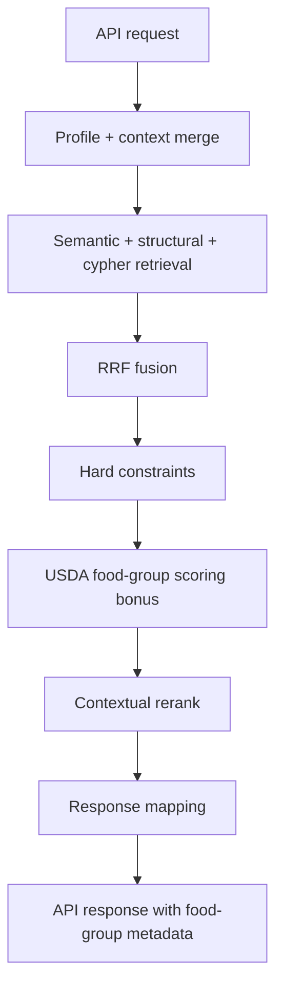
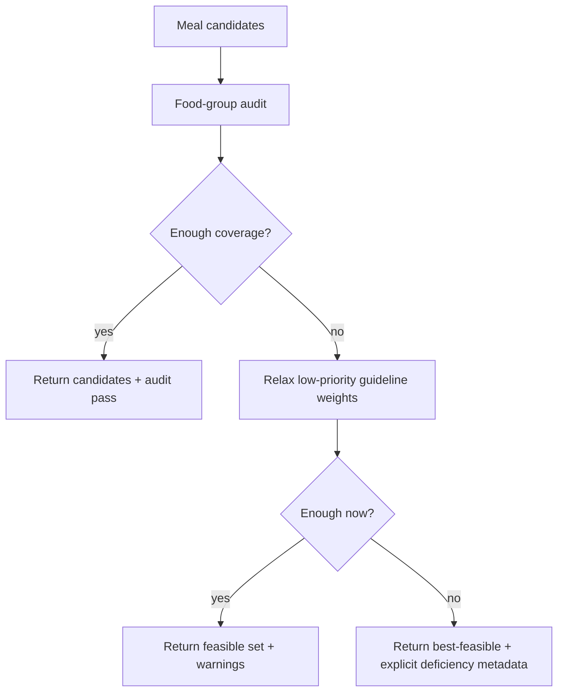

# USDA Implementation Plan

## Objective

Implement PRD-34 USDA 2025 Food Pyramid behavior in the RAG pipeline with explicit edge-case handling, safe rollout flags, and backward-compatible API responses.

## Scope

- In scope (this repo):
  - USDA prompt context injection in RAG prompt path
  - Food-group-aware scoring/reranking in retrieval output
  - Response enrichment (`food_groups`, `food_group_coverage`, audit hints)
  - Meal-candidate audit helper and partial-compliance warnings
- Out of scope (external services/repo):
  - `server/services/mealPlanLLM.ts`, `server/services/mealPlan.ts`, `foodPyramidValidator.ts`
  - External DB migration ownership where not managed in this repo

## Key Principles

- Keep hard safety constraints immutable (allergen, medical hard limits).
- USDA compliance is soft-first by default (configurable strict mode later).
- Never fail silently: infeasible cases return best-feasible output with explicit warnings.
- Preserve backward compatibility for existing endpoints.

## Target Flow

## Phase A - Foundation Data and Contracts (P0)

### A1. USDA guideline config module

- Add a reusable guideline config with:
  - food groups: `protein`, `dairy`, `vegetables`, `fruits`, `whole_grains`
  - target defaults
  - soft thresholds
  - priority order and weights
- Files:
  - `rag_pipeline/config.py`
  - `rag_pipeline/orchestrator/usda_guidelines.py` (new)

### A2. Canonical food-group extraction contract

- Standardize recipe payload -> food-group inference shape.
- Prefer payload fields; fallback to heuristics if missing.
- Files:
  - `rag_pipeline/augmentation/fusion.py`
  - `api/app.py`

### A3. Guideline source strategy

- If Supabase/Postgres is accessible from runtime:
  - Read `gold.nutritional_guidelines` and `gold.nutritional_soft_guidelines`
  - Add in-memory cache and fallback defaults
- If not accessible:
  - Use local defaults + integration hooks
- Files:
  - `api/app.py`
  - `rag_pipeline/orchestrator/orchestrator.py`

## Phase B - Prompt Injection (P0)

### B1. USDA context in prompt

- Add USDA 2025 section to system prompt:
  - food-group priorities
  - advisory soft guidelines
  - instruction to avoid one-group-only meal suggestions
- Files:
  - `rag_pipeline/augmentation/prompt_builder.py`
  - `rag_pipeline/generation/generator.py` (only if message assembly hook is needed)

### B2. Feature flag

- Add config flag:
  - `ENABLE_USDA_2025_PROMPT_CONTEXT`
- Default off for initial deployment.

## Phase C - Ranking and Retrieval Behavior (P0)

### C1. Food-group diversity bonus

- Implement `food_group_balance_score(payload)` with bounded multiplier (ex: 0.9-1.2).
- Apply post-fusion before final contextual rerank.
- Files:
  - `rag_pipeline/orchestrator/constraint_filter.py`
  - `rag_pipeline/orchestrator/orchestrator.py`

### C2. Preserve hard filters

- Keep safety filters first and non-relaxable:
  - allergens
  - medical hard constraints

### C3. Scoring order

1. Hard constraints
2. USDA diversity bonus
3. Contextual rerank (recent meals/calorie/cuisine)

## Phase D - API Response Enrichment (P1)

### D1. Optional response fields

- Add optional metadata fields:
  - `food_groups: list[str]`
  - `food_group_coverage: float`
  - `usda_balance_hint: str | None`
- File:
  - `api/app.py`

### D2. Merge helper updates

- Populate fields in:
  - `_merge_results`
  - `_merge_results_with_profile`
- File:
  - `api/app.py`

### D3. Compatibility

- Keep fields optional and non-breaking.

## Phase E - Candidate and Meal-Plan Audit Support (P1)

### E1. Audit utility

- Add utility to:
  - aggregate food-group totals across selected recipes
  - scale target by calorie target
  - classify status as `below`, `adequate`, `above`
- Files:
  - `rag_pipeline/orchestrator/food_group_audit.py` (new)
  - `api/app.py` (`/recommend/meal-candidates` enrichment)

### E2. Infeasible output policy

- If not enough coverage:
  - return best-feasible candidates
  - include `audit_warnings`
  - set `guideline_compliance: "partial"`
  - include missing groups list

### E3. Deterministic relaxation ladder

- Relax USDA soft goals in this order:
  1. whole_grains
  2. fruits
  3. vegetables
  4. dairy
  5. protein (last)
- Never relax safety constraints.

## Phase F - Observability and Rollout (P0/P1)

### F1. Metrics/counters

- Add counters:
  - `usda_prompt_injected_count`
  - `food_group_inference_missing_fields_count`
  - `usda_bonus_applied_count`
  - `meal_candidate_audit_partial_count`
  - `meal_candidate_audit_fail_count`
- Files:
  - `rag_pipeline/logging_utils.py`
  - `api/app.py`

### F2. Runtime flags

- `ENABLE_USDA_2025_PROMPT_CONTEXT`
- `ENABLE_USDA_FOOD_GROUP_BONUS`
- `ENABLE_USDA_AUDIT_METADATA`
- `USDA_STRICT_MODE` (default false)

### F3. Rollout sequence

1. Deploy prompt context only
2. Enable food-group bonus for small traffic slice
3. Enable response metadata
4. Enable meal-candidate audit warnings
5. Keep strict mode off until metrics stabilize

## Testing Plan

### Unit tests

- Food-group extraction from payload variants
- Coverage-score range and monotonicity
- Scaled target computation by calorie target
- Audit status classification

### Integration tests

- `/recommend/feed` returns optional food-group metadata
- Ranking gains diversity without violating hard constraints
- `/recommend/meal-candidates` includes partial-compliance warnings when needed

### Regression tests

- No behavior change when USDA flags are disabled
- Existing endpoints stay schema-compatible

## Edge Cases and Required Behavior

- Too few recipes after USDA checks:
  - return best-feasible output and warnings, not empty silent failure
- Missing food-group signals:
  - mark unknown and continue safely
- Conflicting constraints:
  - hard safety constraints win
- Low-confidence inference:
  - reduce bonus impact
- Strict mode + infeasible:
  - return structured insufficiency explanation

## Acceptance Criteria for Completion

- USDA context is injected in prompts behind flag.
- Post-fusion ranking includes food-group diversity bonus.
- API responses support optional food-group metadata.
- Meal-candidate endpoint can return structured audit warnings.
- Infeasible scenarios return explicit partial-compliance output.
- Metrics support safe rollout and monitoring.
- Existing behavior remains unchanged when flags are off.

## Execution Order

1. Foundation config/constants
2. Prompt injection
3. Food-group extraction and bonus scoring
4. Orchestrator/feed/candidate wiring
5. API schema/metadata enrichment
6. Audit utility + infeasible-case response handling
7. Tests + metrics + staged rollout
