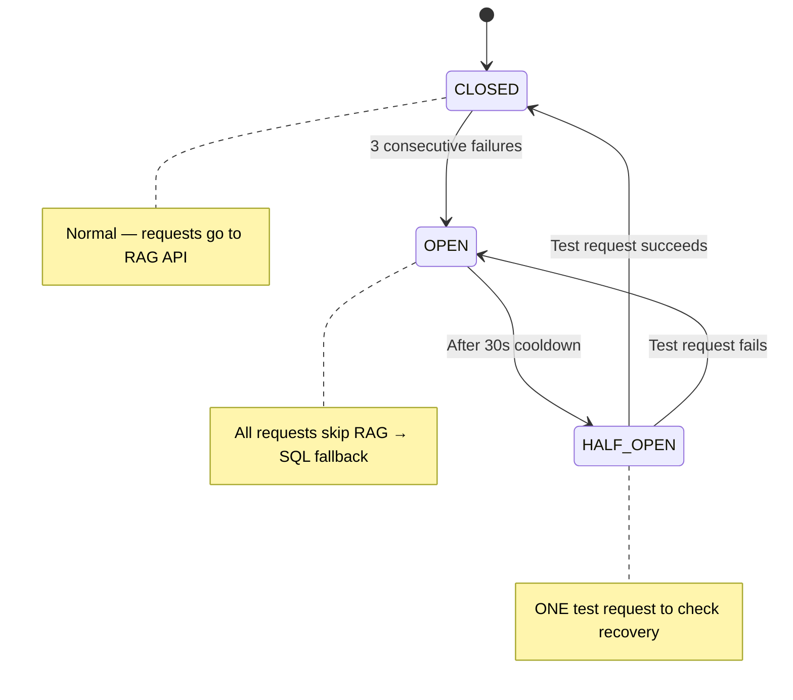

# PRD-01: Foundation & RAG Infrastructure

> **Tech Stack:** Next.js (frontend), Express + Drizzle ORM (backend), FastAPI (RAG API), Neo4j 5 (graph DB), PostgreSQL `gold` schema, LiteLLM proxy → OpenAI models
> **Auth:** Appwrite (B2B auth) → Express validates JWT → Express calls RAG API with service-to-service `X-API-Key`
> **Repos:** `nutrib2b-v20` (frontend), `nutriapp-backend` (backend), `rag-pipeline-hybrid-reterival` (RAG API)
> **Vendor Scoping:** All operations are scoped to a single vendor via `vendor_id` from auth context. The RAG pipeline MUST enforce this on every query.

---

## 1.1 Overview

Set up the infrastructure layer that every Graph RAG feature in the B2B app depends on: wrap the existing RAG pipeline in FastAPI endpoints for B2B use cases, create a resilient `ragClient.ts` in Express with circuit breaker + SQL fallback, automate PG→Neo4j B2B data sync, and expand the Neo4j schema with B2B-specific nodes and relationships.

**Core Resilience Rule:** If Neo4j or the RAG API fails at any point, the B2B app MUST continue working using existing SQL services. Users see identical UI — just less intelligent results. This is **silent degradation**. Each feature has its own independent on/off flag for progressive rollout.

**Current State:**

- Neo4j: Populated with B2B nodes (Vendor, B2BCustomer, Product, Ingredient, Allergen, HealthCondition, DietaryPreference) + GraphSAGE embeddings. No HTTP API for B2B — CLI-only pipeline.
- Express backend: Fully functional SQL services (products, customers, compliance, quality, alerts, search). No RAG integration.
- Frontend: No knowledge of RAG layer.

## 1.2 User Stories

| ID | Story | Priority |
|----|-------|----------|
| FN-1 | As a developer, I wrap the RAG pipeline in FastAPI HTTP endpoints for B2B so Express can call it | P0 |
| FN-2 | As a developer, I have a `ragClient.ts` with circuit breaker so the app survives RAG outages | P0 |
| FN-3 | As a developer, I can enable/disable each graph feature independently via env flags | P0 |
| FN-4 | As a developer, PG B2B data automatically syncs to Neo4j on a schedule | P0 |
| FN-5 | As a developer, Neo4j has uniqueness constraints and indexes for all B2B node types | P0 |
| FN-6 | As a developer, I can check the circuit breaker status via an admin endpoint | P1 |
| FN-7 | As a developer, all RAG API calls are logged with latency and fallback metrics | P1 |
| FN-8 | As a developer, a `b2b_chat_sessions` table exists for chatbot session persistence | P0 |

## 1.3 Technical Architecture

### 1.3.1 System Architecture Diagram

```
┌──────────────────────┐     ┌─────────────────────────────────┐     ┌──────────────┐
│  nutrib2b-v20        │     │  nutriapp-backend (Express)     │     │  Supabase    │
│  (Next.js Frontend)  │────▶│  server/routes/*.ts             │────▶│  gold schema │
│  Pages:              │     │  server/services/ragClient.ts   │     └──────────────┘
│  /customers          │     │  Circuit Breaker + Feature Flags│
│  /products           │     └────────────┬────────────────────┘
│  /search             │                  │ X-API-Key
│  /dashboard          │                  ▼
│  /compliance         │     ┌─────────────────────────────────┐     ┌──────────────┐
└──────────────────────┘     │  RAG Pipeline (FastAPI)         │────▶│  Neo4j       │
                             │  B2B Endpoints:                 │     │  Graph DB    │
                             │    POST /b2b/recommend-products │     └──────────────┘
                             │    POST /b2b/search             │            ▲
                             │    POST /b2b/product-customers  │            │
                             │    POST /b2b/chat               │     ┌──────┴──────┐
                             │    POST /b2b/substitutions      │     │  OpenAI LLM │
                             │    POST /b2b/safety-check       │     └─────────────┘
                             │    POST /b2b/product-intel      │
                             │    POST /b2b/search-suggest     │
                             │    GET  /health                 │
                             └─────────────────────────────────┘
```

### 1.3.2 ragClient.ts — Circuit Breaker + SQL Fallback

#### [NEW] `server/services/ragClient.ts`

**Circuit Breaker State Machine:**



**Per-Feature Independent Flags (all OFF by default):**

| Flag | Feature | PRD | Timeout |
|------|---------|-----|---------|
| `USE_GRAPH_RECOMMEND` | Customer Recommendations | PRD-02 | 5s |
| `USE_GRAPH_SEARCH` | Graph-Enhanced Search | PRD-03 | 3s |
| `USE_GRAPH_MATCH` | Product-Customer Matching | PRD-04 | 5s |
| `USE_GRAPH_CHATBOT` | B2B Chatbot | PRD-05 | 10s |
| `USE_GRAPH_ANALYTICS` | Health Analytics | PRD-06 | 3s |
| `USE_GRAPH_SAFETY` | Safety Engine | PRD-07 | 5s |
| `USE_GRAPH_INTEL` | Ingredient Intelligence | PRD-08 | 3s |
| `USE_GRAPH_SUBSTITUTE` | Smart Substitution | PRD-09 | 5s |

**Request Flow (3 gates before any RAG call):**

1. **Gate 1 — Feature flag:** Is this feature's graph flag ON? If not → return `null` → SQL.
2. **Gate 2 — Circuit breaker:** Is the circuit CLOSED or HALF_OPEN? If OPEN → return `null` → SQL.
3. **Gate 3 — HTTP call with timeout:** Call RAG API. If timeout/error → increment failure count → return `null` → SQL.

```typescript
// server/services/ragClient.ts

interface CircuitState {
  status: "CLOSED" | "OPEN" | "HALF_OPEN";
  failureCount: number;
  lastFailureAt: number;
  cooldownMs: number;
}

const circuit: CircuitState = {
  status: "CLOSED",
  failureCount: 0,
  lastFailureAt: 0,
  cooldownMs: 30_000,
};

export async function callRag<T>(
  endpoint: string,
  body: Record<string, unknown>,
  featureFlag: string,
  timeoutMs: number = 5000
): Promise<T | null> {
  // Gate 1: Feature flag
  if (process.env[featureFlag] !== "true") return null;

  // Gate 2: Circuit breaker
  if (circuit.status === "OPEN") {
    if (Date.now() - circuit.lastFailureAt > circuit.cooldownMs) {
      circuit.status = "HALF_OPEN";
    } else {
      return null;
    }
  }

  // Gate 3: HTTP call with timeout
  try {
    const controller = new AbortController();
    const timer = setTimeout(() => controller.abort(), timeoutMs);
    
    const res = await fetch(`${process.env.RAG_API_URL}${endpoint}`, {
      method: "POST",
      headers: {
        "Content-Type": "application/json",
        "X-API-Key": process.env.RAG_API_KEY!,
      },
      body: JSON.stringify(body),
      signal: controller.signal,
    });
    
    clearTimeout(timer);
    
    if (!res.ok) throw new Error(`RAG API ${res.status}`);
    
    const data = await res.json() as T;
    circuit.status = "CLOSED";
    circuit.failureCount = 0;
    return data;
  } catch (err) {
    circuit.failureCount++;
    circuit.lastFailureAt = Date.now();
    if (circuit.failureCount >= 3) circuit.status = "OPEN";
    console.error(`[ragClient] ${endpoint} failed (${circuit.failureCount}/3):`, err);
    return null;
  }
}

// Convenience wrappers for each feature
export const ragRecommend = (body: Record<string, unknown>) =>
  callRag("/b2b/recommend-products", body, "USE_GRAPH_RECOMMEND");

export const ragSearch = (body: Record<string, unknown>) =>
  callRag("/b2b/search", body, "USE_GRAPH_SEARCH");

export const ragMatch = (body: Record<string, unknown>) =>
  callRag("/b2b/product-customers", body, "USE_GRAPH_MATCH");

export const ragChat = (body: Record<string, unknown>) =>
  callRag("/b2b/chat", body, "USE_GRAPH_CHATBOT", 10_000);

export const ragSafetyCheck = (body: Record<string, unknown>) =>
  callRag("/b2b/safety-check", body, "USE_GRAPH_SAFETY");

export const ragSubstitutions = (body: Record<string, unknown>) =>
  callRag("/b2b/substitutions", body, "USE_GRAPH_SUBSTITUTE");

export const ragProductIntel = (body: Record<string, unknown>) =>
  callRag("/b2b/product-intel", body, "USE_GRAPH_INTEL");

export const ragSearchSuggest = (body: Record<string, unknown>) =>
  callRag("/b2b/search-suggest", body, "USE_GRAPH_SEARCH");

export function getCircuitStatus() {
  return { ...circuit };
}
```

**Fallback Mapping (when `callRag()` returns `null`):**

| Feature | RAG Function | SQL Fallback | What User Loses |
|---------|-------------|--------------|-----------------|
| Recommendations | `ragRecommend()` | No recommendations shown | Graph-scored personalized products |
| Search | `ragSearch()` | Client-side keyword filter | Semantic/NLP search, suggestions |
| Product-Customer Match | `ragMatch()` | No matching shown | Allergen-safe customer list |
| Chatbot | `ragChat()` | "Service unavailable" | Entire chatbot |
| Safety Engine | `ragSafetyCheck()` | SQL cross-join only | Cross-reactivity detection |
| Substitution | `ragSubstitutions()` | No substitutions shown | Dynamic graph-based alternatives |
| Ingredient Intel | `ragProductIntel()` | Basic product data only | Diet compatibility, suitability |

### 1.3.3 PG → Neo4j B2B Sync

**Sync Strategy:** Scheduled MERGE-based sync (idempotent, safe to re-run, uses read-only PG credentials).

| Priority | PG Table(s) | Neo4j Target | Frequency |
|----------|-------------|-------------|-----------|
| P0 | `b2b_customers` | `B2BCustomer` | Every 15 min |
| P0 | `b2b_customer_allergens` | `[:ALLERGIC_TO]` with severity | Every 15 min |
| P0 | `b2b_customer_dietary_preferences` | `[:FOLLOWS_DIET]` | Every 15 min |
| P0 | `b2b_customer_health_conditions` | `[:HAS_CONDITION]` with severity | Every 15 min |
| P0 | `b2b_customer_health_profiles` | `B2BHealthProfile` | Every 15 min |
| P0 | `products` + `product_ingredients` | `Product`, `[:CONTAINS_INGREDIENT]` | Every 15 min |
| P1 | `ingredient_allergens` | `[:CONTAINS_ALLERGEN]` (Ingredient→Allergen) | Every 6 hours |
| P1 | `product_dietary_preferences` | `[:COMPATIBLE_WITH_DIET]` | Every 6 hours |
| P2 | `health_condition_ingredient_restrictions` | `[:RESTRICTS_INGREDIENT]` | Every 6 hours |
| P2 | `customer_product_interactions` | `[:PURCHASED]`, `[:VIEWED]`, etc. | Every 6 hours |

### 1.3.4 PostgreSQL — 1 New Table

#### [NEW] `b2b_chat_sessions` table

```sql
CREATE TABLE gold.b2b_chat_sessions (
  id UUID PRIMARY KEY DEFAULT gen_random_uuid(),
  vendor_id UUID NOT NULL REFERENCES gold.vendors(id) ON DELETE CASCADE,
  user_id UUID NOT NULL,  -- Appwrite user ID
  session_data JSONB NOT NULL DEFAULT '{}',
  message_count INT NOT NULL DEFAULT 0,
  last_intent VARCHAR(50),
  created_at TIMESTAMPTZ NOT NULL DEFAULT NOW(),
  last_activity_at TIMESTAMPTZ NOT NULL DEFAULT NOW(),
  expires_at TIMESTAMPTZ NOT NULL DEFAULT NOW() + INTERVAL '30 minutes'
);

CREATE INDEX idx_b2b_chat_sessions_vendor ON gold.b2b_chat_sessions(vendor_id);
CREATE INDEX idx_b2b_chat_sessions_user ON gold.b2b_chat_sessions(user_id);
CREATE INDEX idx_b2b_chat_sessions_expires ON gold.b2b_chat_sessions(expires_at)
  WHERE expires_at < NOW();
```

### 1.3.5 Frontend Changes

None in this PRD — this is pure infrastructure. Frontend changes are in feature-specific PRDs (02–10).

---

## 1.RAG — RAG Team Scope

> **Repo:** `rag-pipeline-hybrid-reterival`
> **Owner:** RAG Pipeline Engineer
> **The B2B team does NOT touch these files.** This section documents what the RAG team must deliver for this PRD.

### Deliverables

#### 1. FastAPI B2B Wrapper

Create B2B-specific endpoints in `api/app.py` (or a new `api/b2b_routes.py`). All 8 B2B endpoints listed in Section 1.3.1 must be implemented:

| Endpoint | Handler | Input | Output |
|----------|---------|-------|--------|
| `GET /health` | Health check | — | `{ status, neo4j, pg_sync_last_run }` |
| `POST /b2b/recommend-products` | Customer product recommendations | `{ b2b_customer_id, vendor_id, allergens, health_conditions, dietary_preferences, health_profile, limit }` | `{ products: [{ id, name, score, reasons }], explanation }` |
| `POST /b2b/search` | NLP product search | `{ query, vendor_id, filters, limit }` | `{ results: [{ id, score, reasons }], query_interpretation }` |
| `POST /b2b/product-customers` | Product→customer matching | `{ product_id, vendor_id, limit }` | `{ customers: [{ id, name, match_score, reasons, warnings }] }` |
| `POST /b2b/chat` | B2B chatbot | `{ message, vendor_id, user_id, session_id }` | `{ response, intent, entities, session_id }` |
| `POST /b2b/substitutions` | Smart substitution finder | `{ product_id, vendor_id, customer_id?, limit }` | `{ substitutes: [{ id, name, score, reasons }] }` |
| `POST /b2b/safety-check` | Product-customer safety analysis | `{ vendor_id, product_ids?, customer_ids? }` | `{ conflicts: [...], summary }` |
| `POST /b2b/product-intel` | Ingredient intelligence | `{ product_id, vendor_id }` | `{ ingredients, allergens, diet_compatibility, customer_suitability }` |
| `POST /b2b/search-suggest` | Search query suggestions | `{ query, vendor_id }` | `{ suggestions: [string], entities_found }` |

#### 2. Service-to-Service Auth

- Implement `X-API-Key` middleware that validates the shared secret from request headers
- Reject requests without valid key with 401
- All B2B endpoints MUST accept and enforce `vendor_id` parameter

#### 3. Vendor-Scoping Requirement

> **CRITICAL:** Every Neo4j query in B2B endpoints MUST include `vendor_id` in the MATCH clause. A B2B customer from Vendor A must NEVER see products from Vendor B.

Pattern:

```cypher
MATCH (p:Product)-[:SOLD_BY]->(v:Vendor {id: $vendor_id})
MATCH (c:B2BCustomer)-[:BELONGS_TO_VENDOR]->(v)
```

#### 4. PG → Neo4j Sync Script (`sync/b2b_pg_sync.py`)

- Connect to PG via read-only credentials (`PG_READ_URL`)
- MERGE-based sync for all B2B tables in Section 1.3.3
- Idempotent (safe to re-run)
- Must sync relationship **properties** (severity, quantity, etc.) not just existence
- Cron-compatible (exit 0 on success, non-zero on error)
- Log sync stats (rows synced per table, duration)

#### 5. Neo4j Schema Expansion (see PRD-B2B-Neo4j-Gaps doc for full details)

Run before first sync:

- Uniqueness constraints for all B2B node types
- Performance indexes for vendor_id, customer lookups, date ranges
- Add missing relationship properties (severity on ALLERGIC_TO, etc.)

#### 6. Environment Variables (RAG API side)

```env
NEO4J_URI=bolt://neo4j:7687
NEO4J_USERNAME=neo4j
NEO4J_PASSWORD=<secure-password>
NEO4J_DATABASE=neo4j
PG_READ_URL=postgresql://<read-only-user>:<password>@<supabase-host>:5432/postgres
RAG_API_KEY=<shared-secret>
```

---

## 1.4 Acceptance Criteria

- [ ] `/health` endpoint returns `{ status: "ok", neo4j: "connected" }`
- [ ] All 8 B2B RAG API endpoints respond to POST requests with valid responses
- [ ] `ragClient.ts` compiles and all `ragXxx()` functions return `null` when flags are OFF
- [ ] Circuit breaker trips after 3 consecutive failures, auto-resets after 30s
- [ ] HALF_OPEN state allows exactly one test request
- [ ] PG→Neo4j sync runs without errors for all P0 tables
- [ ] Sync correctly populates `severity` properties on relationships
- [ ] `b2b_chat_sessions` table exists in PG with correct indexes
- [ ] Feature flags default to `false` — existing SQL services work unchanged
- [ ] Admin endpoint returns circuit state

## 1.5 Route Registration

Add to `server/routes.ts`:

```typescript
import { getCircuitStatus } from "./services/ragClient.js";

// Admin endpoint for circuit breaker diagnostics
app.get("/api/v1/admin/rag-status", requireAuth, (req, res) => {
  res.json(getCircuitStatus());
});
```

## 1.6 Environment Variables

```env
# RAG API connection (Express → FastAPI)
RAG_API_URL=http://rag-api:8000
RAG_API_KEY=<shared-secret>

# Per-feature flags (all OFF by default)
USE_GRAPH_RECOMMEND=false
USE_GRAPH_SEARCH=false
USE_GRAPH_MATCH=false
USE_GRAPH_CHATBOT=false
USE_GRAPH_ANALYTICS=false
USE_GRAPH_SAFETY=false
USE_GRAPH_INTEL=false
USE_GRAPH_SUBSTITUTE=false

# Sync (PG→Neo4j, read-only credentials)
PG_READ_URL=postgresql://<read-only-user>:<password>@<supabase-host>:5432/postgres
```
