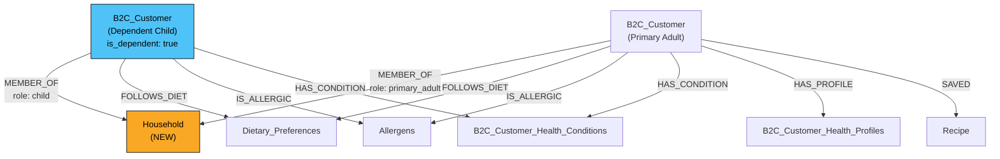

# Household-Aware RAG Pipeline: Changes Required

# Household-Aware RAG Pipeline: Changes Required

> **Audience:** RAG Pipeline Team**Companion doc:** [B2C Implementation Plan (for Backend/Frontend Team)](file:///C:/Users/Sourav%20Patil/.gemini/antigravity/brain/91c55d32-f474-47c5-bd70-e5f9624b3ab1/implementation_plan.md)

***

## 1. Context & Motivation

The B2C platform supports **household management** — a primary user can add family members (spouse, children, teens) who each have their own health profiles (allergens, diets, health conditions).

**Problem:** The RAG pipeline currently personalizes recommendations for a **single user** only. It has no concept of:

* An "active member" whose profile should drive filtering
* "Family-wide" queries like "what can I cook for my family?"
* Household members in the Neo4j graph

**Goal:** Enable the RAG pipeline to deliver member-specific and family-wide personalized recommendations.

***

## 2. Current State Analysis

### What Already Works

| Component                       | Current Behavior                                                      | Household Ready?                        |
| ------------------------------- | --------------------------------------------------------------------- | --------------------------------------- |
| `fetch_customer_profile()`      | Queries Neo4j by `customer_id` → returns diets, allergens, conditions | ✅ Works for any `B2C_Customer` node     |
| `merge_profile_into_entities()` | Merges profile dict into entities                                     | ✅ Profile-source agnostic               |
| `orchestrate()`                 | Accepts `customer_profile` dict                                       | ✅ Doesn't care where profile comes from |
| `apply_hard_constraints()`      | Filters by allergen/diet/calorie entities                             | ✅ Works with any entities               |

### What Has ZERO Household Awareness

| Component         | File                                                                                                                      | Gap                                                                             |
| ----------------- | ------------------------------------------------------------------------------------------------------------------------- | ------------------------------------------------------------------------------- |
| NLU Rules         | [nlu.py](file:///c:/Users/Sourav%20Patil/Desktop/ASM/B2C/rag-pipeline-hybrid-reterival/chatbot/nlu.py)                    | No patterns for "family", "kids", "everyone"                                    |
| Intent Enum       | [intents.py](file:///c:/Users/Sourav%20Patil/Desktop/ASM/B2C/rag-pipeline-hybrid-reterival/rag_pipeline/nlu/intents.py)   | No family-related intents                                                       |
| Entity Extraction | [nlu.py L542-634](file:///c:/Users/Sourav%20Patil/Desktop/ASM/B2C/rag-pipeline-hybrid-reterival/chatbot/nlu.py#L542-L634) | `_extract_entities_by_rules()` never extracts `family_scope`                    |
| Chat Endpoint     | [app.py L372-410](file:///c:/Users/Sourav%20Patil/Desktop/ASM/B2C/rag-pipeline-hybrid-reterival/api/app.py#L372-L410)     | `ChatProcessRequest` has no `member_id` or `household_members` field            |
| Feed Endpoint     | [app.py L212-216](file:///c:/Users/Sourav%20Patil/Desktop/ASM/B2C/rag-pipeline-hybrid-reterival/api/app.py#L212-L216)     | `FeedRequest` has no member profile override                                    |
| Neo4j Graph       | —                                                                                                                         | No `Household` nodes, no `MEMBER_OF` relationships, no dependent customer nodes |

***

## 3. Changes Required

### Phase 1: Accept Member Context (Low Effort)

The B2C backend will start sending `member_id` and optionally a pre-built `member_profile` dict. The RAG pipeline needs to accept and use these.

#### 3.1 Schema Changes

##### \[MODIFY] `ChatProcessRequest` in [app.py L372-378](file:///c:/Users/Sourav%20Patil/Desktop/ASM/B2C/rag-pipeline-hybrid-reterival/api/app.py#L372-L378)

```diff
 class ChatProcessRequest(BaseModel):
     message: str = Field(..., min_length=1, max_length=1000)
     customer_id: str = Field(..., description="B2C customer UUID")
     session_id: str | None = Field(None)
     display_name: str | None = Field(None)
+    member_id: str | None = Field(None, description="Active household member UUID (when different from customer_id)")
+    member_profile: dict[str, Any] | None = Field(
+        None,
+        description="Pre-built profile for the active member: {diets: [], allergens: [], health_conditions: []}"
+    )
```

##### \[MODIFY] `FeedRequest` in [app.py L212-216](file:///c:/Users/Sourav%20Patil/Desktop/ASM/B2C/rag-pipeline-hybrid-reterival/api/app.py#L212-L216)

```diff
 class FeedRequest(BaseModel):
     customer_id: str = Field(...)
     meal_type: str | None = Field(None)
     limit: int = Field(50, ge=1, le=50)
+    member_id: str | None = Field(None, description="Active household member UUID")
+    member_profile: dict[str, Any] | None = Field(
+        None,
+        description="Pre-built profile: {diets: [], allergens: [], health_conditions: [], health_goal: str}"
+    )
```

##### \[MODIFY] `SearchRequest` in [app.py L204-209](file:///c:/Users/Sourav%20Patil/Desktop/ASM/B2C/rag-pipeline-hybrid-reterival/api/app.py#L204-L209)

```diff
 class SearchRequest(BaseModel):
     query: str = Field(..., max_length=500)
     customer_id: str | None = Field(None)
     filters: dict[str, Any] = Field(default_factory=dict)
     limit: int = Field(20, ge=1, le=50)
+    member_id: str | None = Field(None, description="Active household member UUID")
+    member_profile: dict[str, Any] | None = Field(
+        None,
+        description="Pre-built profile for the active member"
+    )
```

#### 3.2 Profile Resolution Logic

In each endpoint handler, when `member_profile` is provided, use it instead of fetching from Neo4j:

##### \[MODIFY] `/recommend/feed` handler in [app.py \~L890](file:///c:/Users/Sourav%20Patil/Desktop/ASM/B2C/rag-pipeline-hybrid-reterival/api/app.py#L890)

```diff
-    profile = fetch_customer_profile(_driver, req.customer_id, database)
+    # Use pre-built member profile if provided; else Neo4j lookup
+    if req.member_profile:
+        profile = {
+            "display_name": None,
+            "diets": req.member_profile.get("diets", []),
+            "allergens": req.member_profile.get("allergens", []),
+            "health_conditions": req.member_profile.get("health_conditions", []),
+            "health_goal": req.member_profile.get("health_goal"),
+            "activity_level": req.member_profile.get("activity_level"),
+            "recent_recipes": [],
+        }
+    else:
+        profile = fetch_customer_profile(_driver, req.customer_id, database)
```

Same pattern for `/search/hybrid` and `/chat/process`.

> \[!TIP]
> The `member_profile` dict uses the **exact same shape** as `fetch_customer_profile()` output. No new data structures needed.

***

### Phase 2: NLU Family Detection (Medium Effort)

#### 3.3 Add Family Keyword Patterns

##### \[MODIFY] [nlu.py](file:///c:/Users/Sourav%20Patil/Desktop/ASM/B2C/rag-pipeline-hybrid-reterival/chatbot/nlu.py)

**Add after line 83** (after `SUBSTITUTION_FOLLOW_UP_PATTERN`):

```python
# Phrases indicating the user wants recommendations for their household
FAMILY_SCOPE_PATTERN = re.compile(
    r"\b("
    r"my family|the family|whole family|our family|"
    r"everyone|all of us|the household|"
    r"my kids?|my child(ren)?|my son|my daughter|"
    r"my wife|my husband|my partner|my spouse|"
    r"safe for everyone|everyone can eat|"
    r"family.?friendly|kid.?friendly|"
    r"the whole house|cook for all"
    r")\b", re.I
)
```

#### 3.4 Extract `family_scope` Entity

> \[!IMPORTANT]
> We are NOT adding a new intent. `family_scope` is an **entity** on existing intents like `find_recipe`, `plan_meals`, etc.

##### \[MODIFY] `_extract_entities_by_rules()` in [nlu.py L542-634](file:///c:/Users/Sourav%20Patil/Desktop/ASM/B2C/rag-pipeline-hybrid-reterival/chatbot/nlu.py#L542-L634)

**Add at the top of the function** (before intent-specific cases):

```python
def _extract_entities_by_rules(message: str, intent: str) -> dict[str, Any] | None:
    # ── Family scope detection (applies to any recipe/meal intent) ──
    family_scope = None
    if FAMILY_SCOPE_PATTERN.search(message):
        family_scope = "all"  # "all" = entire household

    # ... existing intent-specific logic ...

    # find_recipe: try diet + course
    if intent == "find_recipe":
        entities = {}
        if family_scope:
            entities["family_scope"] = family_scope
        # ... rest of existing logic
```

#### 3.5 Family Scope Entity Values

| Value             | Meaning                                   | Example User Query               |
| ----------------- | ----------------------------------------- | -------------------------------- |
| `"all"`           | All household members                     | "what can I cook for my family?" |
| `"member:{name}"` | Specific named member                     | "what can my son eat?" (future)  |
| `null` / absent   | Default — use active member from frontend | "find keto recipes"              |

#### 3.6 Chat Handler: Use Household Profile

When `family_scope: "all"` is detected AND `member_profile` or `household_members` is provided:

##### \[MODIFY] `/chat/process` handler in app.py

```python
# After NLU extraction:
nlu_result = extract_hybrid(req.message, context)

# If family scope detected, use pre-built household profile
if nlu_result.entities.get("family_scope") == "all" and req.member_profile:
    # Backend sends combined household profile when this flag is set
    profile = req.member_profile  # Already union of all allergens, intersection of diets
else:
    profile = fetch_customer_profile(_driver, req.customer_id, database)
```

> \[!NOTE]
> The B2C backend is responsible for computing the combined household profile (union of allergens, intersection of diets). The RAG pipeline just uses whatever profile dict it receives.

***

### Phase 3: Neo4j Graph Expansion (Higher Effort)

#### 3.7 New Node: `Household`

```cypher
CREATE (h:Household {
    id: "uuid-from-supabase",
    type: "family",           -- family | single | shared_living
    name: "The Smith Family",
    created_at: datetime()
})
```

**Properties:**

| Property     | Type     | Source                       |
| ------------ | -------- | ---------------------------- |
| `id`         | UUID     | `gold.households.id`         |
| `type`       | String   | `gold.households.type`       |
| `name`       | String   | `gold.households.name`       |
| `created_at` | DateTime | `gold.households.created_at` |

#### 3.8 New Relationship: `MEMBER_OF`

```cypher
MATCH (c:B2C_Customer {id: "member-uuid"})
MATCH (h:Household {id: "household-uuid"})
CREATE (c)-[:MEMBER_OF {
    role: "primary_adult",    -- primary_adult | secondary_adult | teen | child
    joined_at: datetime()
}]->(h)
```

#### 3.9 Dependent B2C\_Customer Nodes

Currently, only users with Appwrite accounts have `B2C_Customer` nodes in Neo4j. **Dependents** (children, teens added via "Add Member") exist only in Supabase.

**What needs to happen:**

Create `B2C_Customer` nodes for dependents with all their health relationships:

```cypher
-- Create dependent node
CREATE (c:B2C_Customer {
    id: "supabase-b2c-customer-uuid",
    full_name: "Emma Smith",
    is_dependent: true,   -- NEW property to distinguish
    age: 8,
    household_role: "child"
})

-- Add health relationships (same as regular users)
MATCH (c:B2C_Customer {id: "emma-uuid"})
MATCH (a:Allergens {name: "Peanut"})
CREATE (c)-[:IS_ALLERGIC]->(a)

MATCH (c:B2C_Customer {id: "emma-uuid"})
MATCH (dp:Dietary_Preferences {name: "Gluten-Free"})
CREATE (c)-[:FOLLOWS_DIET]->(dp)

MATCH (c:B2C_Customer {id: "emma-uuid"})
MATCH (hc:B2C_Customer_Health_Conditions {name: "Celiac Disease"})
CREATE (c)-[:HAS_CONDITION]->(hc)
```

#### 3.10 Updated Graph Schema



#### 3.11 New Cypher for Household Profile Fetch

Add a new function alongside `fetch_customer_profile()`:

```python
def fetch_household_profile(
    driver: Driver,
    household_id: str,
    database: str | None = None,
) -> dict[str, Any]:
    """
    Fetch combined health profile for ALL members of a household.
    
    Strategy:
      - Allergens: UNION (if ANY member is allergic → exclude ingredient)
      - Diets: INTERSECTION (only diets ALL members follow)
      - Conditions: UNION (respect all conditions)
    """
    cypher = """
    MATCH (h:Household {id: $household_id})<-[:MEMBER_OF]-(c:B2C_Customer)
    OPTIONAL MATCH (c)-[:FOLLOWS_DIET]->(dp:Dietary_Preferences)
    OPTIONAL MATCH (c)-[:IS_ALLERGIC]->(a:Allergens)
    OPTIONAL MATCH (c)-[:HAS_CONDITION]->(hc:B2C_Customer_Health_Conditions)
    WITH h,
         collect(DISTINCT c.id) AS member_ids,
         collect(DISTINCT dp.name) AS all_diets,
         collect(DISTINCT a.name) AS all_allergens,
         collect(DISTINCT hc.name) AS all_conditions,
         count(DISTINCT c) AS member_count
    RETURN
      all_allergens AS allergens,
      all_conditions AS health_conditions,
      all_diets AS diets,
      member_count
    """
    # Note: diet intersection requires post-processing
    # (collect DISTINCT gives union; need per-member diet lists to compute intersection)
```

> \[!WARNING]
> Diet intersection in Cypher is complex. A simpler approach: the B2C backend computes the intersection in TypeScript and passes the result in `member_profile`. The RAG pipeline just uses it.

***

#### 3.12 Sync Mechanism

**When to sync Supabase → Neo4j:**

| Event                        | Source                                         | Action                                                    |
| ---------------------------- | ---------------------------------------------- | --------------------------------------------------------- |
| User completes onboarding    | B2C Backend (`supabaseSync.ts`)                | Create/update `B2C_Customer` + health relationships       |
| Member added (Add flow)      | `household.ts` → `addMember()`                 | Create `B2C_Customer` (is\_dependent: true) + `MEMBER_OF` |
| Member health profile edited | `household.ts` → `updateMemberHealthProfile()` | Update `FOLLOWS_DIET`, `IS_ALLERGIC`, `HAS_CONDITION`     |
| Household created            | On first member add or invite accept           | Create `Household` node + `MEMBER_OF`                     |
| Member removed               | `household.ts` → `deleteMember()`              | Remove `B2C_Customer` node + relationships                |

**Recommended approach:** The B2C backend fires sync calls to a new RAG endpoint (or directly to Neo4j via a shared driver).

***

## 4. Summary: Priority Order

| Priority | Change                                                                               | Files               | Effort    |
| -------- | ------------------------------------------------------------------------------------ | ------------------- | --------- |
| **P0**   | Accept `member_profile` dict in `/recommend/feed`, `/search/hybrid`, `/chat/process` | `app.py`            | 1–2 hours |
| **P1**   | Add `FAMILY_SCOPE_PATTERN` + extract `family_scope` entity                           | `nlu.py`            | 2–3 hours |
| **P2**   | Use `family_scope` in chat handler to switch profile                                 | `app.py`            | 1–2 hours |
| **P3**   | Create `Household` nodes + `MEMBER_OF` relationships                                 | Neo4j schema + sync | 1–2 days  |
| **P4**   | Create dependent `B2C_Customer` nodes in Neo4j                                       | Neo4j schema + sync | 1 day     |
| **P5**   | `fetch_household_profile()` Cypher function                                          | `app.py`            | 2–3 hours |

> \[!TIP]
> **P0 alone unblocks the B2C team** from shipping household-aware feed/search/chatbot. P1-P5 can be done incrementally.
