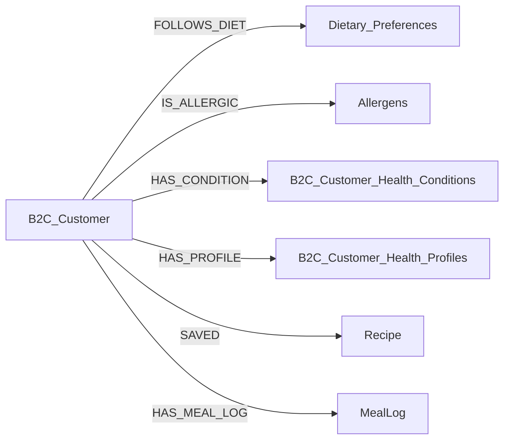
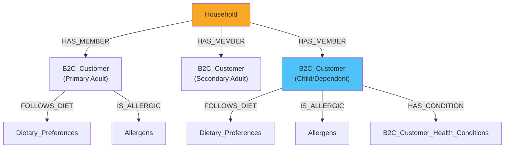
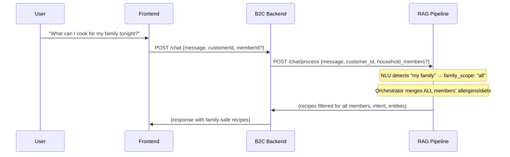

# Household-Aware RAG Pipeline: Critical Analysis & Brainstorm

# Household-Aware RAG Pipeline: Critical Analysis & Brainstorm

## Executive Summary

After deep-scanning all 3 codebases (B2C Frontend, B2C Backend, RAG Pipeline), the picture is clear:

| Layer                                         | Household Awareness | Gap                                      |
| --------------------------------------------- | ------------------- | ---------------------------------------- |
| Frontend (member-switcher)                    | ⚠️ Partial          | Exists but not wired to feed/search/chat |
| Backend (meal-log, nutrition, scan, mealPlan) | ✅ Full              | Already accepts `memberId`               |
| Backend (feed, search, chatbot)               | ❌ None              | Always uses logged-in user               |
| RAG Pipeline (NLU)                            | ❌ None              | Zero family/household detection          |
| RAG Pipeline (Orchestrator)                   | ✅ Ready             | Already has `customer_profile` param     |
| Neo4j Graph                                   | ❌ None              | No dependent/household nodes             |

***

## 1. NLU Gap: Zero Family/Household Detection

### Current State

The chatbot NLU ([nlu.py](file:///c:/Users/Sourav%20Patil/Desktop/ASM/B2C/rag-pipeline-hybrid-reterival/chatbot/nlu.py)) has two tiers:

* **Tier 1 (Rules):** 13 regex patterns for `find_recipe`, `plan_meals`, `log_meal`, etc.
* **Tier 2 (LLM):** Falls back to `extract_intent()` when rules miss

**Neither tier recognizes family/household keywords.** There are no patterns for:

* "for my family"
* "safe for my kids"
* "everyone can eat"
* "my son is allergic to..."
* "cook for the whole house"

### What Needs to Change in the RAG Pipeline

> \[!IMPORTANT]
> This is the ONE area where the RAG pipeline itself needs modification.

#### Option A: NLU Entity Extraction (Recommended)

Add `family_scope` as a new entity, not a new intent. The existing `find_recipe` intent stays, but entities gain context:

```python
# New entity: family_scope
# Values: "all" | "member:{name}" | None (default = active member from frontend)

# Example NLU outputs:
# "find keto recipes for my family"     → intent: find_recipe, entities: {diet: ["Keto"], family_scope: "all"}
# "what can my son eat"                 → intent: find_recipe, entities: {family_scope: "member:son"}
# "dinner safe for everyone"            → intent: find_recipe, entities: {course: "dinner", family_scope: "all"}
```

#### Family Keyword Patterns (Tier 1 Addition)

```python
FAMILY_PATTERNS = re.compile(
    r"\b(my family|the family|whole family|everyone|"
    r"all of us|the household|my house|my kids?|"
    r"my child(ren)?|my son|my daughter|"
    r"safe for everyone|everyone can eat|"
    r"the whole house)\b", re.I
)
```

When detected, extract `family_scope: "all"` and let the orchestrator merge **all household members'** constraints.

#### Option B: New Intent (Not Recommended)

Adding a `find_recipe_for_family` intent would require changes to every downstream component (constraint\_filter, cypher\_generator, prompt builder). The entity approach is far cleaner.

***

## 2. Search Behavior Options

The user asked "what options do we have" for search. Here's the full analysis:

### Option 1: Auto-Apply Active Member's Constraints (Recommended)

When a member is selected in the frontend switcher, their allergens/diets are **automatically** applied as exclusion filters in search.

| Pros                          | Cons                                           |
| ----------------------------- | ---------------------------------------------- |
| Safest for allergies          | May restrict results unexpectedly              |
| Consistent with feed behavior | User might not realize filters are active      |
| No extra UI needed            | Need a clear "filtering for: {Name}" indicator |

### Option 2: Opt-In Per Search

Show a toggle: "Apply {Name}'s dietary restrictions" in the search UI.

| Pros                  | Cons                                    |
| --------------------- | --------------------------------------- |
| User has full control | Easy to forget to enable                |
| No surprise filtering | Allergen safety not enforced by default |

### Option 3: Hybrid (Best of Both)

* **Allergens always auto-applied** (safety — non-negotiable)
* **Diets shown as removable chips** (user can toggle off "Keto" but not "Peanut-Free")

> \[!WARNING]
> Allergens are safety-critical. I strongly recommend Option 1 or Option 3 (hybrid), where allergen exclusion is always automatic.

***

## 3. Neo4j Design: Household Members & Dependents

### Current Neo4j Graph Structure



**Problem:** Only users with Appwrite accounts have `B2C_Customer` nodes. Dependents (children added via "Add Member") exist only in Supabase and have no Neo4j presence.

### How Dependents Are Stored Today (Supabase)

```
gold.b2c_customers table:
├── id (uuid)                    ← Every member gets this
├── appwrite_id (text NULL)      ← NULL for dependents (no account)
├── household_id (uuid)          ← Links to households table
├── household_role (varchar)     ← primary_adult, secondary_adult, child, teen
├── full_name (text)
├── date_of_birth (date)
└── birth_month, birth_year, age ← Derived from DOB

gold.b2c_customer_health_profiles:  ← Dependents CAN have health profiles
gold.b2c_customer_allergens:        ← Dependents CAN have allergens
gold.b2c_customer_dietary_preferences: ← Dependents CAN have diets
gold.b2c_customer_health_conditions:   ← Dependents CAN have conditions
```

**Key insight:** Dependents have full health data in Supabase. They just lack Neo4j representation.

### Proposed Neo4j Additions



#### New Nodes

| Node Label  | Properties                                          | Source            |
| ----------- | --------------------------------------------------- | ----------------- |
| `Household` | `id`, `type` (single/family/shared\_living), `name` | `gold.households` |

#### New Relationships

| Relationship | From           | To          | Properties                                     |
| ------------ | -------------- | ----------- | ---------------------------------------------- |
| `MEMBER_OF`  | `B2C_Customer` | `Household` | `role` (primary\_adult/child/etc), `joined_at` |

#### Modified Nodes

| Node           | Change                                                                                                |
| -------------- | ----------------------------------------------------------------------------------------------------- |
| `B2C_Customer` | Add dependents as nodes (currently only Appwrite users are synced). Add `is_dependent: true` property |

#### Required Sync Process

A new sync process to create Neo4j nodes for dependents:

1. **When a dependent is added** (Add Member flow) → Create `B2C_Customer` node in Neo4j with `is_dependent: true`
2. **When dependent's health profile is edited** → Sync `FOLLOWS_DIET`, `IS_ALLERGIC`, `HAS_CONDITION` relationships
3. **When household is created** → Create `Household` node and `MEMBER_OF` relationships
4. **Structural retrieval** can then work for dependents via the `Household` → `B2C_Customer` → `SAVED` path

> \[!CAUTION]
> This is a **significant** addition. It requires:

***

## 4. Chatbot Family Intent Detection

### How It Should Work



### Implementation Approach

**In the RAG Pipeline** ([nlu.py](file:///c:/Users/Sourav%20Patil/Desktop/ASM/B2C/rag-pipeline-hybrid-reterival/chatbot/nlu.py)):

1. Add family keyword detection in `_extract_entities_by_rules()` for `find_recipe` intent
2. When `family_scope: "all"` is detected, the backend must pass ALL household members' combined profiles

**In the B2C Backend** ([ragClient.ts](file:///c:/Users/Sourav%20Patil/Desktop/ASM/B2C/nutrition-backend-b2c/server/services/ragClient.ts)):

1. When RAG returns `family_scope: "all"`, query all household members' health profiles
2. Merge all allergens (union), all diets (union), all conditions (union)
3. Pass this merged profile to RAG orchestrator

**Alternative approach:** B2C backend pre-computes "household combined profile" and passes it alongside `customer_id`. This way RAG doesn't need to know about households — it just gets a richer profile.

***

## 5. Implementation Priority & Phases

### Phase 1: Quick Wins (Backend + Frontend only, NO RAG changes)

| Change                                                  | Effort | Impact |
| ------------------------------------------------------- | ------ | ------ |
| Feed route accepts `memberId`, passes member's profile  | Small  | High   |
| Search route accepts `memberId`, auto-applies allergens | Small  | High   |
| Chatbot route accepts `memberId` context                | Small  | Medium |
| Frontend wires member-switcher to feed/search/chat      | Small  | High   |

**This phase requires ZERO RAG pipeline changes** — the B2C backend already has all member health data in Supabase and can build the profile dict that RAG expects.

### Phase 2: NLU Enhancement (RAG Pipeline)

| Change                                         | Effort | Impact |
| ---------------------------------------------- | ------ | ------ |
| Add `family_scope` entity extraction to NLU    | Medium | High   |
| Add `FAMILY_PATTERNS` regex to Tier 1 rules    | Small  | High   |
| Add `household_members` param to chat endpoint | Medium | Medium |

### Phase 3: Neo4j Graph Expansion

| Change                                 | Effort | Impact |
| -------------------------------------- | ------ | ------ |
| Create `Household` nodes               | Medium | Medium |
| Sync dependent `B2C_Customer` nodes    | Large  | High   |
| Add `MEMBER_OF` relationships          | Medium | Medium |
| Enable structural retrieval for family | Medium | Medium |

***

## Questions Remaining

1. **Phase 1 vs Full:** Should we implement Phase 1 first (quick wins, no RAG changes) and iterate? Or go straight to Phases 1+2?
2. **Neo4j sync mechanism:** For Phase 3, should we:
   * **(A)** Add Neo4j sync to the existing backend (on member add/edit)
   * **(B)** Create a separate PG→Neo4j sync job (batch, runs every N minutes)
   * **(C)** Skip Neo4j for dependents entirely and always use Supabase profiles?
3. **Combined family profile:** When `family_scope: "all"`, should the combined profile use:
   * **Union** of all allergens (strictest — if ANY member is allergic, exclude it)?
   * **Intersection** of diets (only recipes that satisfy ALL members' diets)?
